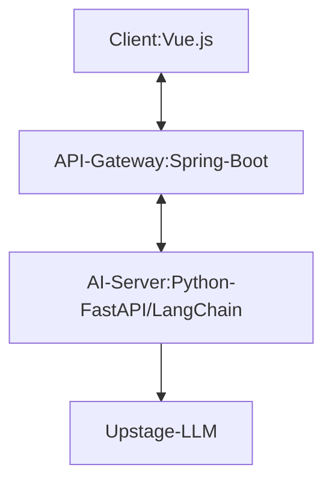

# smart-safety-agent (Prototype)
- 🏗️ Smart Safety Agent (Construction AI)

## 📌 Project Overview
- **산업안전보건 기준에 맞는 안전 수칙을 안내하는 AI 챗봇 서비스**
- LLM(Upstage Solar)를 활용하여 사용자의 자연어 질문에 대해 유연하게 답변할 수 있도록 구현.

## 🎯 Key Features
* **AI 기반 안전 수칙 질의응답:** 사용자가 안전 관련 질문을 하면, 지정된 안전 매뉴얼을 근거로 답변 제공
* **프롬프트 엔지니어링 (Context Injection):**
    * **시스템 프롬프트에 산업안전 매뉴얼(Context)을 직접 주입**하여 답변 정확도 확보
    * 할루시네이션(거짓 답변) 방지를 위한 프롬프트 제어
* **이기종 언어 간 프로세스 연동:**
    * Java(Spring Boot)에서 사용자의 요청을 받아 Python 스크립트를 실행하고 결과를 받아오는 프로세스 구축
    * 실무 레거시 환경에서의 AI 모듈 연동 가능성 검증

## 🛠️ Tech Stack
| Category | Technology |
| :--- | :--- |
| **Frontend** | Vue.js 3, Axios |
| **Backend** | Java 17, Spring Boot 3.5.9 |
| **AI / Logic** | Python 3.11, Upstage Solar API (LLM) |

## 📂 System Architecture

* **Frontend**: Vue.js 3 (Composition API) - 사용자 인터랙션 담당, CDN 형태
* **Backend**: Spring Boot 3.5.9 - 엔터프라이즈급 API 관리 및 보안 계층 역할
* **AI Engine**: Python FastAPI, LangChain - 프롬프트 엔지니어링 및 LLM 연동